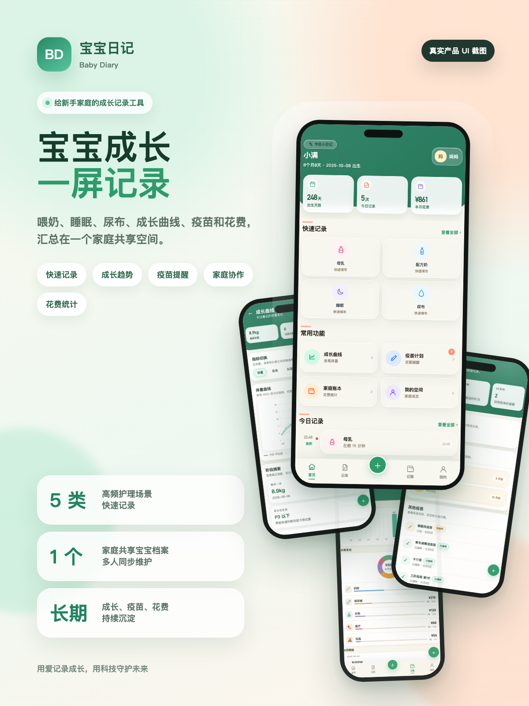
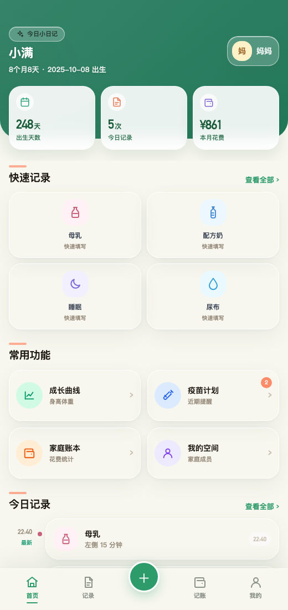
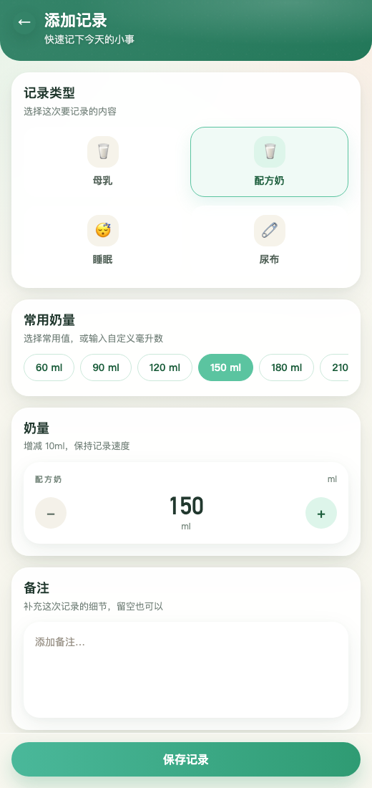
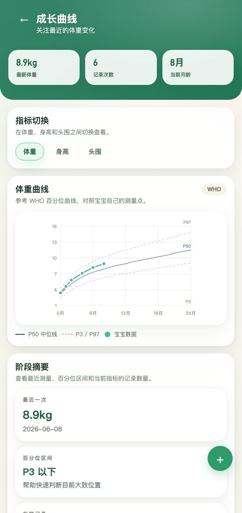
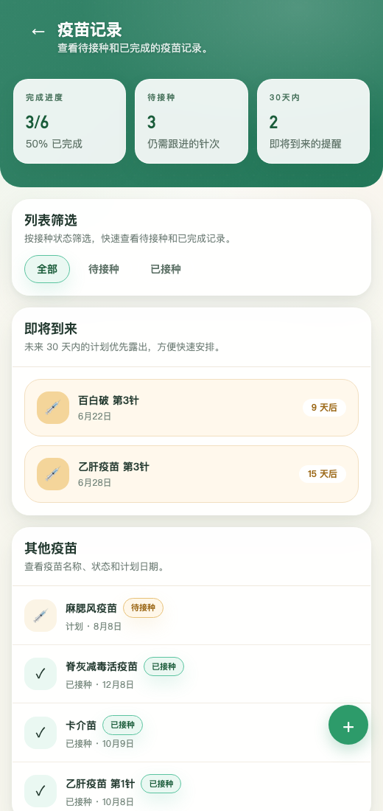
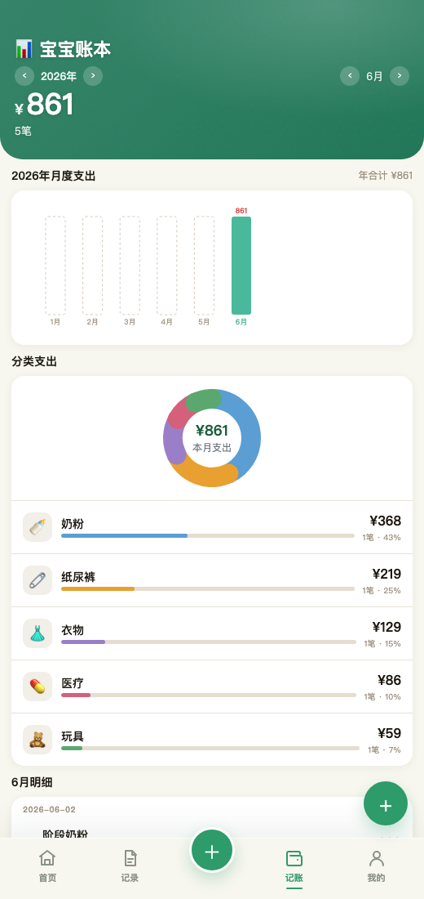
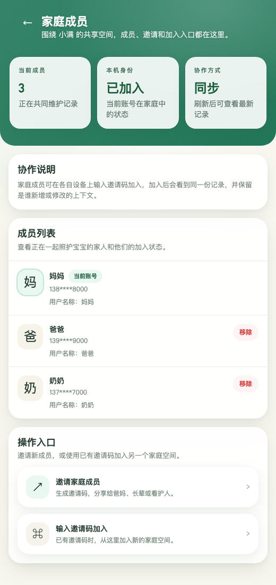
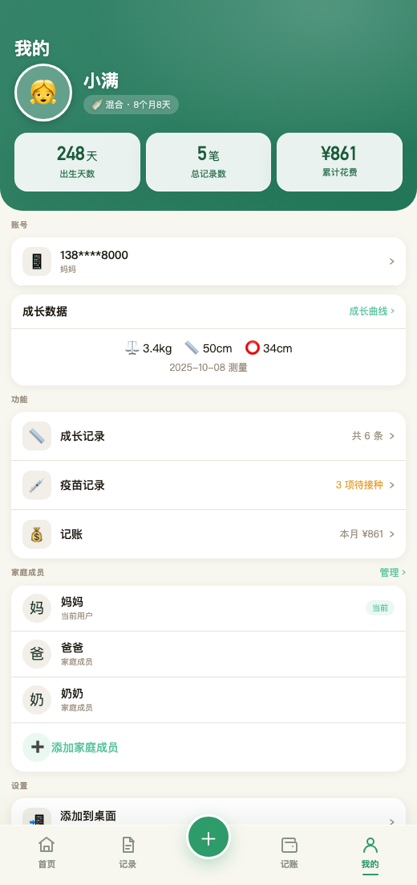

养娃之后，家里的时间会被切成很多细小的片段。

几点喂了奶、睡了多久、换了几次尿布、下次疫苗什么时候打、这个月又给宝宝买了哪些东西。每一件事单独看都不大，但真的落到日常里，很容易散在聊天记录、备忘录、纸条和脑子里。

「宝宝日记」想解决的，就是这件具体的小事：让一个家庭用更轻的方式，记录宝宝每天真实发生的变化。

它不是一个复杂的育儿系统，也不是只给一个人用的记事本。它更像一个围绕宝宝建立的家庭时间线：妈妈、爸爸、长辈或其他照护成员，都可以在同一个空间里记录和查看。

## 打开首页，先看懂今天

首页是「宝宝日记」的总入口。

进入应用后，第一眼能看到宝宝昵称、出生天数、今日记录次数、本月花费，以及喂养、睡眠、尿布、成长、疫苗、账本这些高频入口。对于新手父母来说，这比一个空白表格更友好：不用先想“我要去哪记”，而是打开就能顺着当下的照护场景继续。

比如刚喂完奶，就点母乳或配方奶；宝宝睡醒了，就补一条睡眠；换完尿布，就记录状态。当天发生的事情，会自然沉淀成一条时间线。

这个首页的价值，不在于信息多，而在于把最容易遗漏的信息放在最容易触达的位置。

## 记录要快，才真的会被坚持

很多育儿工具的问题是：功能很完整，但每次记录太重。宝宝哭了、困了、要抱了，父母没有太多耐心填复杂表单。

「宝宝日记」把日常照护拆成几个高频动作：母乳、配方奶、睡眠、尿布。每一种记录都对应独立表单，尽量减少输入成本。

母乳记录可以选择左侧、右侧或双侧，并记录时长；配方奶可以直接选常用毫升数，也能输入自定义奶量；睡眠支持开始和结束时间，也能标记“睡眠中”；尿布则可以记录小便、大便、颜色和备注。

这些字段看起来很细，但它们都来自真实照护场景。记录越贴近当下，父母越不需要重新组织语言，越容易长期坚持。

## 一天结束后，不用靠回忆拼凑

白天忙起来以后，很多事情会混在一起。到底上午几点睡的？今天喝了多少奶？尿布换了几次？谁记录的？

记录页把一天的护理行为按日期整理起来，并汇总母乳次数、配方奶总量、睡眠次数和尿布次数。每条记录都保留具体时间、类型、详情和成员信息。

这条时间线对家庭协作特别有用。

比如妈妈上午记录喂奶，爸爸下午补充支出，奶奶白天记录尿布。晚上回看时，大家看到的是同一份宝宝日常，而不是几个人各记各的。

它让照护不只发生在当下，也能在一天结束后被完整看见。

## 成长曲线，让数字变成趋势

宝宝的身高、体重、头围，单次数字当然重要，但更重要的是趋势。

「宝宝日记」的成长页支持记录体重、身高和头围，并把测量点放到曲线里展示。父母可以看到最近一次测量，也能看到记录次数、当前月龄，以及宝宝自己的变化轨迹。

相比只在备忘录里写下“8.9kg”，曲线更容易回答另一个问题：这段时间是不是在稳定增长？

应用还结合 WHO 参考曲线展示，让父母在看趋势时有一个大致参照。它不能代替医生判断，但可以帮助家庭把每次测量都保存下来，复诊或回顾时也更有依据。

## 疫苗计划，把“别忘了”变成可确认

疫苗是每个家庭都会认真对待、也很容易记混的一件事。

「宝宝日记」把疫苗分成待接种和已完成，并展示完成数量、待接种数量和完成率。近期要打的疫苗会被单独突出，接种日期、医院和状态也可以一起维护。

这类功能的关键，不是制造焦虑，而是减少反复确认。

下次打什么、什么时候打、之前哪些已经完成，打开页面就能看到。对于多个家庭成员共同照护的情况，这种共享的清单尤其重要：不用每个人都单独记一遍，也不用在群聊里反复翻历史消息。

## 宝宝账本，看清每个月花在哪里

养娃支出很少只是一笔大钱，更多时候是一笔笔小钱叠起来：奶粉、纸尿裤、衣物、玩具、医疗、洗护、辅食。

账本页把宝宝相关支出按月、按分类整理，既能看本月总支出，也能看每类支出的占比和年度变化。

这对家庭预算很实用。

有些支出是刚需，有些支出是阶段性的，有些则可能只是短期冲动消费。记录下来以后，家庭可以更清楚地知道钱花在了哪里，也更容易为下个月做安排。

## 家庭协作，让照护不是一个人的事

宝宝的日常照护往往不是由一个人完成的。

「宝宝日记」支持家庭成员加入同一个空间。家人可以通过邀请码进入，共同查看宝宝档案、记录照护行为，并保留是谁新增或修改的上下文。

这个设计对现实家庭很重要。

很多时候，记录断掉不是因为父母不想记，而是照护发生在不同人手里。一个人记在备忘录，另一个人发在群里，第三个人只记在脑子里。家庭协作把这些分散的信息聚到一起，让宝宝的记录真正属于一家人。

## 我的空间，把资料和管理入口收在一起

除了日常记录，「我的」页面提供了宝宝资料、账号信息、成长数据、疫苗待办、支出统计和家庭成员等入口。

它像一个轻量的管理中心：需要查看宝宝基础信息、编辑个人资料、看累计记录、查看花费和待办，都可以从这里进入。

对于移动端使用者来说，它也保留了添加到桌面的入口，让这个 Web 应用更接近一个日常随手打开的手机工具。

## 最后，记录不是为了制造负担

好的育儿记录，不应该让父母更累。

它应该在事情发生时足够快，在一天结束后足够清楚，在家庭成员之间足够同步，在长期回看时足够有价值。

「宝宝日记」想做的就是这件事：把喂奶、睡眠、尿布、成长、疫苗和花费这些细碎日常，整理成一条属于宝宝、也属于全家的成长时间线。

每一次记录都很小。

但一年以后再回头看，那些小小的时间点，会组成宝宝认真长大的证据。

**用爱记录成长，用科技守护未来。**
